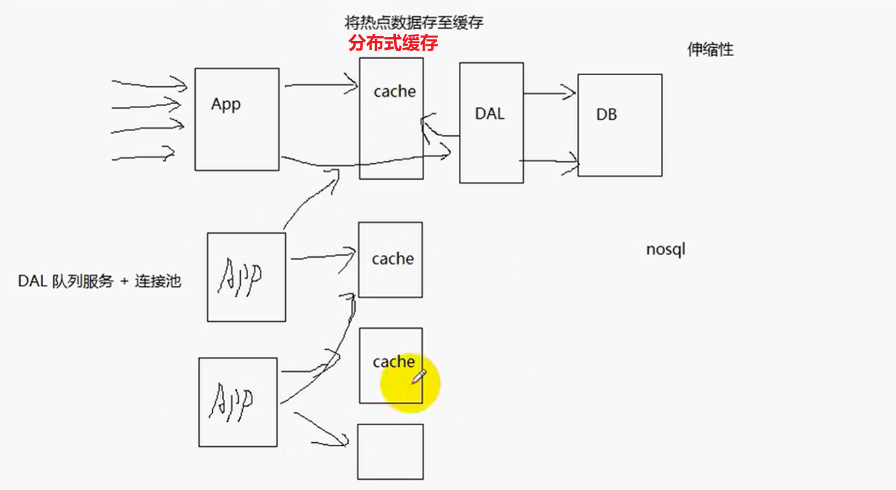
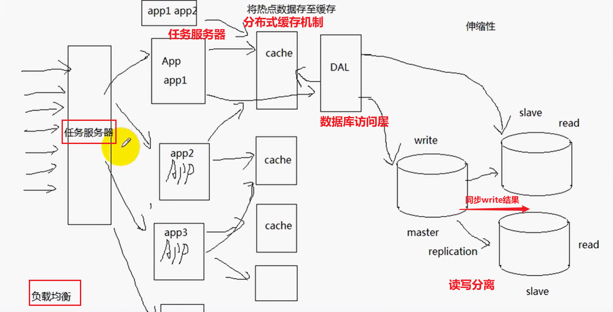
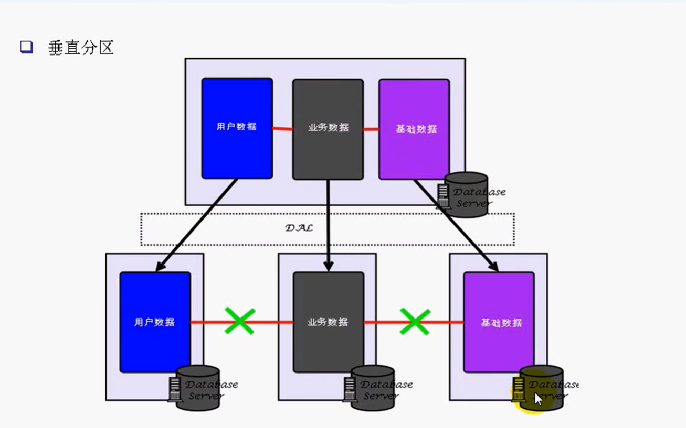
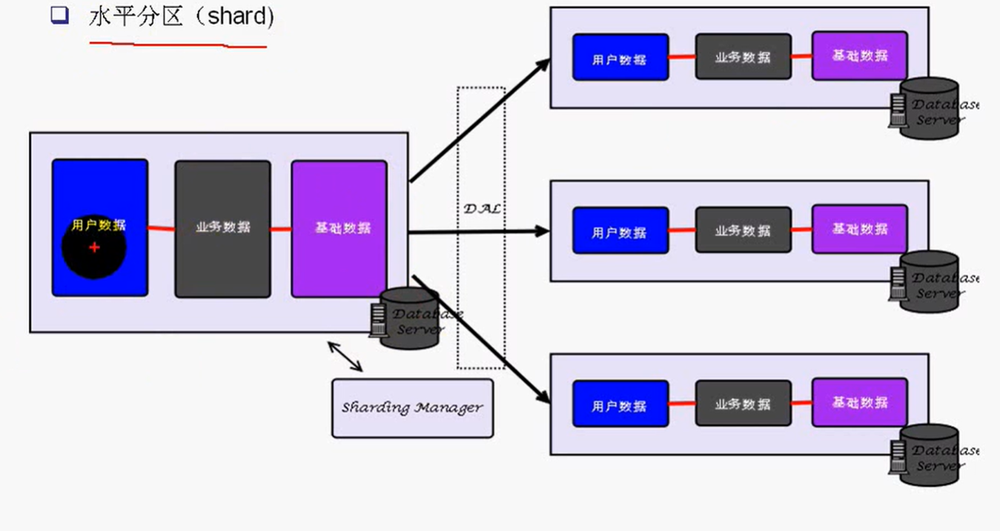
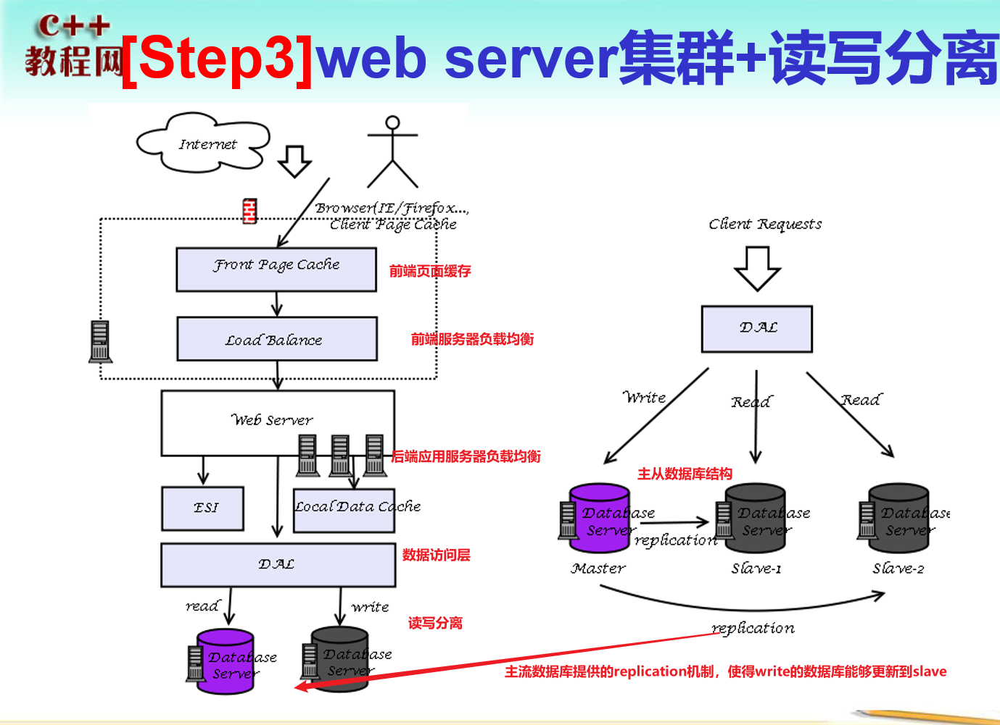
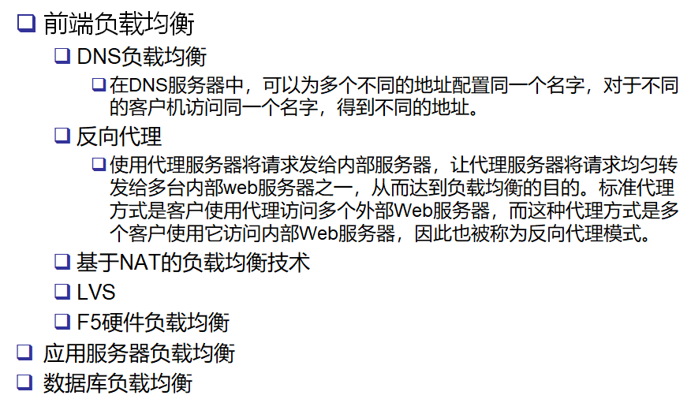
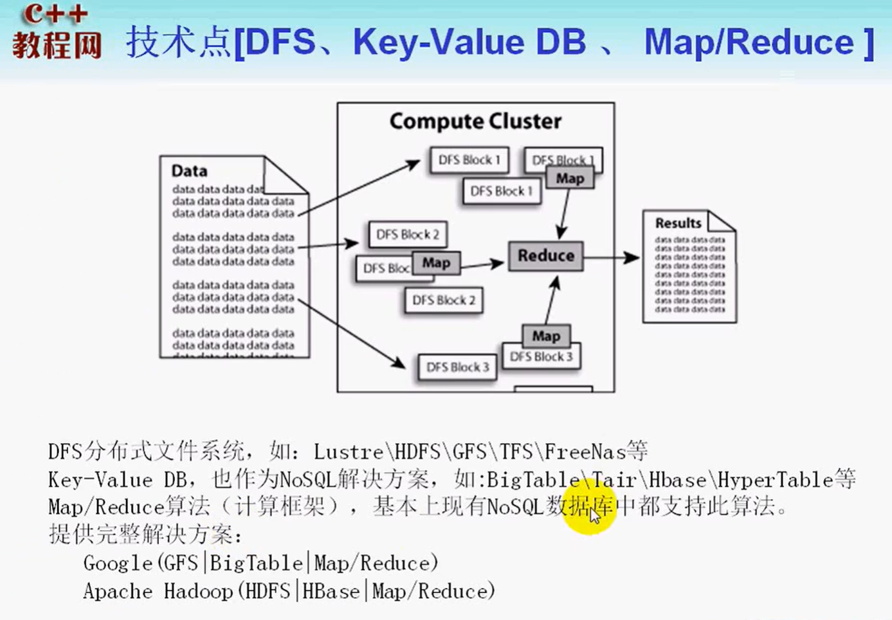
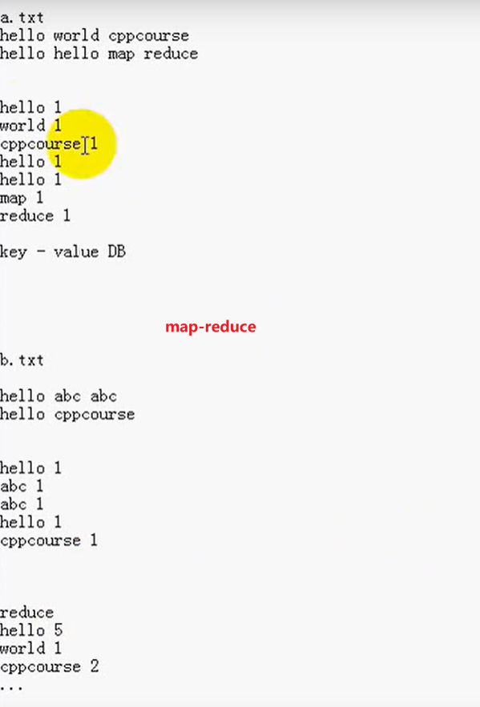
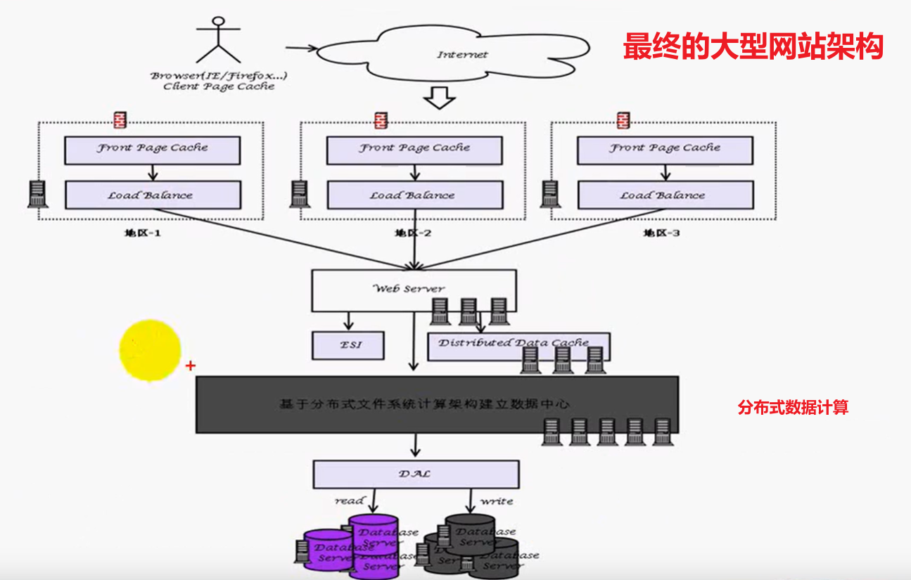
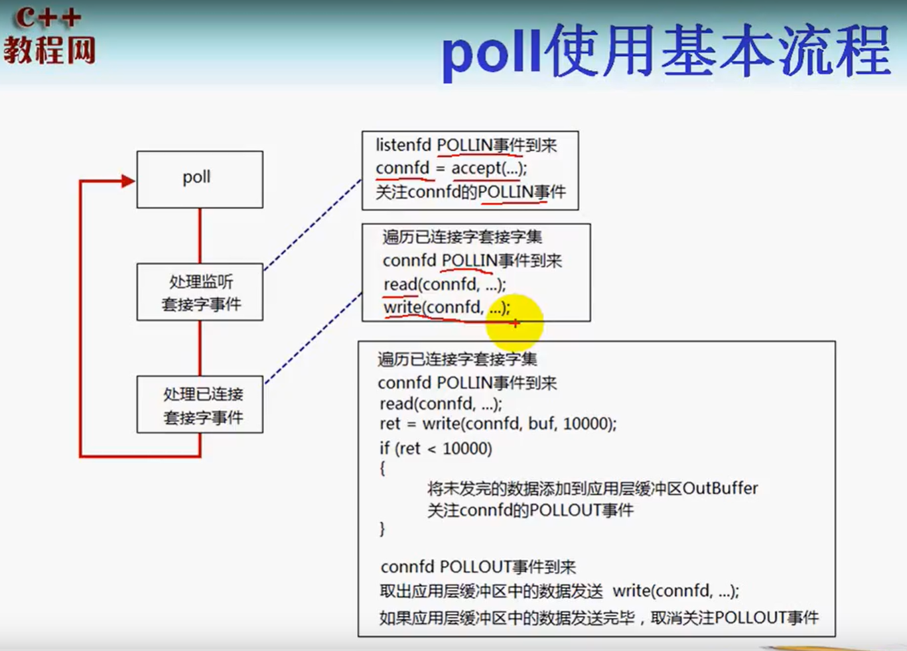

# 大并发服务器架构设计

**服务器设计目标：**

- 高性能：请求、响应
- 高可用：7x24，故障转移
- 伸缩性：要求能够部署在多个服务器端，进程间通信不再采用本地内存

**高并发高请求场景存在的问题：**数据库服务器瓶颈：连接数量、处理请求的速度

## **解决办法（分布式架构思路）：**

	1. 队列+连接池：将主要的业务逻辑挪到应用服务器处理，数据库只做辅助的业务处理
 	2. **缓存机制**
     - 缓冲更新（缓存同步）问题：如果缓存失效，需要重新去数据库查询，**实时性比较差**
     - 一旦数据库中的数据更新，立即通知前端的缓存更新，实时性比较高
	3. **缓存换页：**在内存不够时，将不活跃的数据换出内存
    - FIFO
    - LRU(least recently used)：最近最少使用
    - LFU(least frequently used)：最不频繁使用
	4. 分布式缓存：**redis、memcached**



> **如果cache和app服务器部署在同一个平台上：**cache就不是全局的缓存，而是局部的缓存

5. **读写分离（数据库的负载均衡）：**一般情况下，如果有写操作，那么对数据库的读操作请求会**阻塞**

   > **利用写请求比读请求频次更低的特点**，将数据库分为master/slave，分别处理来自`DAL`的write/read请求。一旦master发生了write操作，就利用数据库的`replication`将修改同步到slave。**提高了并发能力**

6. 数据分区（分库、分表）

   - 分库（垂直分区）：数据库按照不同的表进行区分
   - 水平分区：

7. **应用服务器的负载均衡：**

   > - **增加一个任务服务器来实现**，任务服务器可以监视应用服务器的负载。**通过应用服务器提供的接口查看：CPU高、I/O高、并发高、内存换页高**。任务服务器通过查询这些信息之后，选取负载最低的服务器分配任务（**应用服务器被动**）
   > - **考虑负载均衡公平问题：对于应用服务器处理任务相同的情况，可以考虑让应用服务器在负载空闲的时候主动去任务服务器获取任务**

   

8. 服务器的高可用（high ability）：当服务器出现故障时，能够及时将服务器任务转交给其他的服务器

### 分库和分表






## 服务器性能四大杀手

1. 数据拷贝：通过缓存解决
2. 环境切换：该不该用多线程？（理性创建线程）
   - 对于单核服务器：采用状态机编程，效率最佳。**如果采用多线程，增加线程间的切换开销**
   - 多核服务器：多线程能够充分发挥其性能（也应该避免线程间切换）
3. 内存分配：内存池
4. 锁竞争：尽可能减少锁的竞争

# 大型网站架构演变过程





## NOSQL分布式缓存

**关系数据库：**对一致性要求比较高的数据，（事务、大表join）性能要求较高（锁竞争）

非关系数据库：可以用来处理一些一致性要求不高的数据（通过key-value存储）。**并发性更高**







# Linux下的I/O复用模型

**linux的三种I/O复用模型：**

- select
- poll
- epoll

## poll

```c
struct pollfd{
  	int fd; //file descriptor
    short events; //requested events
    short revents; //returned events;
};

#include <poll.h> //函数原型
int poll(struct pollfd* fds, nfds_t nfds, int timeout); 
/*

*/
```



```c
#include <unistd.h>
#include <sys/types.h>
#include <fcntl.h>
#include <sys/socket.h>
#include <netinet/in.h>
#include <arpa/inet.h>
#include <signal.h>
#include <sys/wait.h>
#include <poll.h>

#include <stdlib.h>
#include <stdio.h>
#include <errno.h>
#include <string.h>

#include <vector>
#include <iostream>

#define ERR_EXIT(m) \
        do \
        { \
                perror(m); \
                exit(EXIT_FAILURE); \
        } while(0)

typedef std::vector<struct pollfd> PollFdList;

int main(void)
{
	signal(SIGPIPE, SIG_IGN); //为什么要忽略SIGPIPE
	signal(SIGCHLD, SIG_IGN);

	//int idlefd = open("/dev/null", O_RDONLY | O_CLOEXEC);
	int listenfd;

	//if ((listenfd = socket(PF_INET, SOCK_STREAM, IPPROTO_TCP)) < 0)
	if ((listenfd = socket(PF_INET, SOCK_STREAM | SOCK_NONBLOCK | SOCK_CLOEXEC, IPPROTO_TCP)) < 0)
		ERR_EXIT("socket");

	struct sockaddr_in servaddr;
	memset(&servaddr, 0, sizeof(servaddr));
	servaddr.sin_family = AF_INET;
	servaddr.sin_port = htons(5188);
	servaddr.sin_addr.s_addr = htonl(INADDR_ANY);

	int on = 1;
	if (setsockopt(listenfd, SOL_SOCKET, SO_REUSEADDR, &on, sizeof(on)) < 0)
		ERR_EXIT("setsockopt");

	if (bind(listenfd, (struct sockaddr*)&servaddr, sizeof(servaddr)) < 0)
		ERR_EXIT("bind");
	if (listen(listenfd, SOMAXCONN) < 0)
		ERR_EXIT("listen");

	struct pollfd pfd;
	pfd.fd = listenfd;
	pfd.events = POLLIN;

	PollFdList pollfds;
	pollfds.push_back(pfd);

	int nready;

	struct sockaddr_in peeraddr;
	socklen_t peerlen;
	int connfd;

	while (1)
	{
		nready = poll(&*pollfds.begin(), pollfds.size(), -1);
		if (nready == -1)
		{
			if (errno == EINTR)
				continue;
			
			ERR_EXIT("poll");
		}
		if (nready == 0)	// nothing happended
			continue;
		
		if (pollfds[0].revents & POLLIN)
		{
			peerlen = sizeof(peeraddr);
			connfd = accept4(listenfd, (struct sockaddr*)&peeraddr,
						&peerlen, SOCK_NONBLOCK | SOCK_CLOEXEC);

			if (connfd == -1)
				ERR_EXIT("accept4");

/*
			if (connfd == -1)
			{
				if (errno == EMFILE)
				{
					close(idlefd);
					idlefd = accept(listenfd, NULL, NULL);
					close(idlefd);
					idlefd = open("/dev/null", O_RDONLY | O_CLOEXEC);
					continue;
				}
				else
					ERR_EXIT("accept4");
			}
*/

			pfd.fd = connfd;
			pfd.events = POLLIN;
			pfd.revents = 0;
			pollfds.push_back(pfd);
			--nready;

			// 连接成功
			std::cout<<"ip="<<inet_ntoa(peeraddr.sin_addr)<<
				" port="<<ntohs(peeraddr.sin_port)<<std::endl;
			if (nready == 0)
				continue;
		}

		//std::cout<<pollfds.size()<<std::endl;
		//std::cout<<nready<<std::endl;
		for (PollFdList::iterator it=pollfds.begin()+1;
			it != pollfds.end() && nready >0; ++it)
		{
				if (it->revents & POLLIN)
				{
					--nready;
					connfd = it->fd;
					char buf[1024] = {0};
					int ret = read(connfd, buf, 1024);
					if (ret == -1)
						ERR_EXIT("read");
					if (ret == 0)
					{
						std::cout<<"client close"<<std::endl;
						it = pollfds.erase(it);
						--it;

						close(connfd);
						continue;
					}

					std::cout<<buf;
					write(connfd, buf, strlen(buf));
					
				}
		}
	}

	return 0;
}
```

> 关于`SIGPIPE`：
>
> 如果客户端关闭了套接字close，而服务器调用了一次write，这时候服务器端会收到一个RST segment（TCP传输层）。并且，如果服务器端再次调用了write，这个时候，就会产生`SIGPIPE`信号。如果没有忽略该信号，那么会导致进程关闭。而我们的服务器端是要求`7x24`小时在线
>
> **TIME_WAIT状态对大并发服务器的影响：**如果服务器端主动断开连接，那么服务器端就会进入`TIME_WAIT`状态
>
> 1. 应尽可能在服务器端避免出现`TIME_WAIT`状态（在协议设计上，应该让客户端主动断开连接。这样就把TIME_WAIT状态分散到大量的客户端）
> 2. 如果客户端不活跃了，一些客户端不断开连接，会占用服务器端的连接资源。服务器端也要有个机制来踢掉不活跃的连接client

